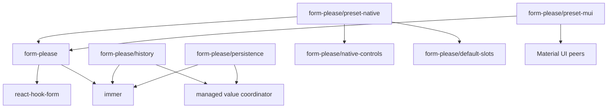

# Architecture

This document describes the current Form, Please runtime and public package
surface.

## System boundary

Form, Please is a React integration over React Hook Form.

| Owner | Responsibility |
| --- | --- |
| Standard Schema | Input validity, issues, and transformed submit output |
| React Hook Form | Editable values, field metadata, validation scheduling, subscriptions, submission state, context, and array operations |
| Form, Please | Typed UI definitions, definition resolution, generated fields, managed value-update coordination, controls, slots, context, and accessibility wiring |
| Application | Product workflow, requests, caches, authorization, storage, server transport, and visual design |

There is no separate Form, Please form store, reducer, command model, server
protocol, or validation cache. The narrow middleware coordinator proposes
changes before committing them to RHF; it does not retain live values. Optional
managed value history retains independent input snapshots for navigation.
Optional form persistence encodes and transports the current editable input.
Neither feature becomes the live form store.

## Package graph

Public JavaScript entries are limited to:

- `form-please`;
- `form-please/default-slots`;
- `form-please/history`;
- `form-please/native-controls`;
- `form-please/persistence`;
- `form-please/preset-native`;
- `form-please/preset-mui`.

`form-please/layout.css` and `form-please/package.json` are explicit non-code
exports. React UI entries are client modules; the optional history and
persistence entries have no React component or hook dependency. React Hook Form
7.76.1 or newer within major version 7 is a required peer. Immer is a direct
runtime dependency. Material UI and Emotion peers remain optional because only
the Material UI preset uses them.

## Canonical modules

| Module | Responsibility |
| --- | --- |
| `src/types.ts` | Schema, path, control, definition, resolver, slot, and structural types |
| `src/control-definition.ts` | Validate and freeze a typed control definition |
| `src/definition.ts` | Validate, normalize, and synchronously resolve UI definitions |
| `src/standard-schema-resolver.ts` | Validate through Standard Schema once and translate all issues to and from RHF errors |
| `src/create-form-kit.tsx` | Create kits, bind React Hook Form, render generated UI, submit, and focus errors |
| `src/value-middleware.ts` | Produce Immer patches, run the fixed Redux-shaped middleware chain, and coordinate terminal value transactions |
| `src/history/history.ts` | Retain managed input positions, navigate them through the coordinator, and import or export in-memory journals |
| `src/persistence/persistence.ts` | Restore and autosave complete editable input through the coordinator and an application adapter |
| `src/persistence/encoding.ts` | Encode, decode, version, migrate, and validate the persistence envelope |
| `src/resource.ts` | Pure `ResourceState`, `matchResource`, and `fromResource` helpers |
| `src/use-snapshot.ts` | Adapt any external store with `subscribe` and `getSnapshot` to React |
| `src/index.ts` | Canonical root exports |

Default slots, native controls, and presets depend on these canonical modules.
They do not define another runtime.

## Form-kit ownership

`createFormKit` freezes one controls, slots, and grid snapshot. `defineFragment`
validates and snapshots reusable schema-owned UI, while `defineForm` normalizes
a complete definition. Fragment placements and form bindings are accepted only
by their exact runtime kit.

`forContext<Context>()` is a type-only view. It returns the same runtime kit.
When `Context` is concrete, `useForm` requires a context value. A fragment can
use a narrower view to declare its minimum context requirement; a host context
may structurally provide additional properties.

The kit does not support runtime extension. Build one complete controls and
slots registry before calling `createFormKit`.

## Definition model

A definition contains a Standard Schema and a recursive UI tree.

- A field selects a schema input path and a compatible registered control.
- A section groups nodes and supplies grid layout.
- An array selects an array path, defines one typed item default, and contains
  nodes relative to an item.
- A render node inserts a component that receives inherited `disabled` and
  `readOnly` state.
- A fragment placement inserts one schema-owned UI template at a compatible
  object path or at the current scope.

Sections and arrays can nest recursively. Paths use RHF dot notation, including
numeric array segments such as `speakers.0.name`. `FieldPath`, `PathValue`, and
`ArrayFieldPath` delegate to RHF path types. Generated arrays contain object
items; primitive arrays can use an application-owned control.

The type system aligns field paths with control values, control options,
control context, slot options, array item defaults, and grid values.

`defineFragment` retains the exact supplied Standard Schema as
`fragment.schema`. `fragment.fields({ at })` creates an opaque authoring
placement; omitting `at` selects the current form or array-item scope. The
selected object may contain additional properties but must structurally satisfy
the fragment schema input. Normalization expands nested placements, prefixes
paths, namespaces explicit IDs by `at` when present, and leaves only field,
section, array, and render nodes in the normalized definition. A fragment has
no independent validation pass, state, or lifecycle.

## Resolution

`kit.Fields` watches the complete React Hook Form value. Each change
resolves the complete UI tree. Resolution reuses unchanged node and child-list
references so React skips unaffected generated branches. Form, Please does not
maintain a resolver dependency graph; every dynamic resolver still runs after
each value change. Plain object and array results are compared shallowly; treat
resolved configuration as immutable and replace nested values when they change.

A resolver on an ordinary form node receives:

1. the complete deeply readonly schema input;
2. the deeply readonly runtime context.

A resolver authored inside a fragment instead receives the deeply readonly
value at that fragment placement and the fragment's minimum context. This local
value remains the fragment root inside its nested arrays. Host-wide conditions
belong on ordinary nodes around the placement.

Resolvers must return synchronously. Promise-like results cause an explicit
error. Readonly is a TypeScript contract; the runtime does not deep-clone or
proxy resolver input.

Visibility affects rendering only. Hidden fields preserve their React Hook
Form values because unregistration is disabled.

## Form binding and lifetime

`kit.useForm` creates a thin `FormBinding`:

- `api`: the unchanged typed RHF `UseFormReturn`;
- `definition`: the fixed normalized definition;
- `context`: the Form, Please runtime context;
- `update`: the managed Immer-recipe entry point.

The binding belongs to the exact kit that created it. Another kit's `Form`
rejects it before rendering.

Disabled and read-only state, generated-control references, the submit wrapper,
and the error-summary reference remain private runtime data.

The definition and ordered middleware snapshot are fixed for the hook lifetime.
Passing another definition or middleware list does not replace either one. A
caller must change a React `key` to remount the component and create another
form.

The optional `beforeUpdate` and `afterUpdate` callbacks use their latest React
render versions. They belong to the managed value-update lifecycle rather than
the fixed middleware configuration.

`kit.Form` provides the same API through RHF `FormProvider`. Manual composition
uses ordinary RHF APIs such as `register`, `Controller`, `useController`,
`useWatch`, `useFormState`, `useFieldArray`, and `useFormContext`.

## Managed value updates

Generated control changes, generated array actions, and `form.update(recipe)`
enter one form-local coordinator. An Immer recipe produces authoritative
patches and `nextValues`. Ordered middleware receives a readonly transaction
through `api => next => transaction` and forwards patches synchronously with
`next(patches)`.

Calling `next` commits before it returns. Middleware can append or replace
patches, run post-commit work after `next`, or cancel by returning without
calling it. One middleware can call `next` at most once. Nested managed updates
and asynchronous `next` calls are errors; a later update after async
post-commit work is allowed.

`beforeUpdate` receives the initial transaction and an Immer draft of its
proposed values before middleware. It can adjust the proposal or cancel by
returning `false`. After a commit and the synchronous middleware unwind,
`afterUpdate` receives the final effective transaction. Both hooks are
synchronous, cannot start nested managed updates, and use readonly transaction
views rather than archival snapshots. A post-commit error does not roll values
back.

Generated controls and `form.update` publish final values through one RHF
`setValues` call. RHF remains the sole state owner. Direct calls through
`form.api`, initial values, and reset bypass middleware and managed update hooks
deliberately. Removing a top-level key is rejected because `setValues`
shallow-merges roots; assign `undefined` when the schema permits it.

Managed changes follow `mode` and `reValidateMode` through one public RHF
`trigger` call after commit. `isDirty` remains a whole-value RHF comparison;
`dirtyFields` is guaranteed only for mounted patched paths. Managed triggering
does not preserve RHF's `delayError` timing.

## Managed value history

`form-please/history` is an optional middleware feature. It retains complete
independent schema-input positions only after successful managed value updates.
Initial values, reset, direct `form.api` mutations, and application-owned field
array operations remain outside history. If raw values diverge, the next
managed update or history operation replaces previous navigation branches with
the current values as a non-undoable boundary.

One feature can own separate state for several forms, but each form accepts only
one history feature. `feature.handle(form)` resolves the state for that exact
feature and binding through a package-private coordinator capability; optional
history does not add a field to `FormBinding`.

The root React entry exports the generic `useSnapshot(store)` adapter. History
handles satisfy its structural external-store contract without adding React to
the optional `form-please/history` runtime.

Control transactions on one path can share a timed history group. Other
managed sources create one group each. Retention compacts complete positions,
and editing after undo truncates redo. The default limit is 100 groups.

Undo, redo, seek, and import use a managed `history` source. They pass through
the current `beforeUpdate`, middleware, and `afterUpdate` lifecycle, but commit
complete values through RHF reset so generated array structure and optional
top-level keys synchronize correctly. The reset preserves the original default
baseline and current ephemeral form metadata. Dirty state is recalculated;
RHF may regenerate private array row IDs and remount rows.

`HistoryJournal` version 1 contains complete input entries and a numeric index.
It is an in-memory navigation artifact rather than an event log or persistence
protocol. Import validates the protocol and retention boundary, but editable
entries need not pass Standard Schema validation.

## Form persistence

`form-please/persistence` is an optional middleware feature. It retains only the
complete editable schema input in a package-owned JSON-safe envelope. It does
not retain RHF metadata, runtime context, default values, or managed history.
One feature can own separate state for several forms, but each form accepts one
persistence feature. `feature.handle(form)` resolves the exact configured form.

`restore()` loads once through an application-owned keyed asynchronous adapter.
The restore enters hooks and middleware with a `persistence` source and
`restore` action. Middleware can cancel or transform the input. A successful
commit resets complete RHF values, preserves the original default baseline,
recalculates dirty state, clears interaction and submission metadata, and does
not trigger validation. Editable drafts do not need to pass Standard Schema
validation. If live input changes while load is pending, persistence reports a
conflict without applying stored input.

After restore or explicit `start()`, an RHF subscription observes every value
publication, including raw `form.api` changes. Autosave uses a trailing delay,
coalesces the latest input, and serializes writes. `flush()` writes the current
active input. `clear()` removes storage without changing live input. Storage
failures do not roll values back and retry only after another edit or explicit
operation.

The envelope has its own protocol version and an application version. Migration
runs on decoded older values. Tagged asynchronous codecs support explicit
opaque values; `Date` has an opt-in first-party codec. Applications own storage,
authorization, cross-client coordination, and retention. The feature does not
provide tab synchronization, unload guarantees, or background retry.

## Validation and submission

The definition Standard Schema is the only form-level validator. The internal
RHF resolver collects all issues, including issues without a path. Validation
defaults to submit mode and change revalidation after the first submit.

On a successful submit:

1. `kit.Form` captures a deep editable-input snapshot and the native submit
   control's `name` and `value`. The input preserves browser values such as
   `File` and `Blob`.
2. RHF invokes the internal Standard Schema resolver once.
3. The resolver returns transformed `FormOutput<Schema>`.
4. Form, Please calls `onSubmit({ value, input, form, submitter })` with the
   matching snapshots and output. `submitter` is `null` when the native event
   has no submit control.

Direct `form.api.handleSubmit(onValid, onInvalid)` remains raw RHF behavior and
does not invoke the configured Form Please wrapper. Resolver ownership,
`criteriaMode: "all"`, retained hidden values, and RHF error focus are runtime
invariants. Callers can choose `mode`, `reValidateMode`, and `delayError` but
cannot replace the resolver.

Public issues contain only `message` and optional `path`.

## Generated rendering

`kit.Form` provides RHF and Form Please contexts and owns native submit and
reset event handling. `kit.Fields` resolves and renders the definition.
`kit.AutoForm` composes the error summary and generated fields. `kit.Submit`
delegates to the configured submit slot.

Controls receive typed values and managed updates plus accessibility IDs,
metadata, options, context, and interaction flags. The control contract has no
browser serialization mode. Submission uses React Hook Form values.

Slots own structural markup for fields, sections, arrays, array items, errors,
and submit buttons.

## Arrays

Generated arrays use RHF `useFieldArray`. Paths contain current numeric indexes,
while each React row key uses RHF's stable `field.id`. Managed add, remove, and
move proposals can be cancelled or extended with dependent value patches, then
delegate to native `append`, `remove`, and `move` to preserve row IDs.
Middleware cannot change the source array length or order beyond the proposed
action. The transaction must not change another generated array's structure
because `setValues` cannot synchronize its private row IDs. Dependent values
join the same final React render, although raw RHF subscribers may see the
native array operation before the final value commit. Item defaults are cloned
before insertion. Applications still need a schema-owned ID when row identity
must survive serialization or a new form instance.

History and persistence restore are deliberate exceptions to the normal
generated-array commit path. They reset the complete RHF value tree so every
restored array structure synchronizes. The array values are exact, but RHF can
generate new private row IDs.

## Error focus

RHF focuses the first registered invalid field, including application-owned
fields, and therefore owns focus order. After RHF's focus attempts, Form Please
focuses the first error-summary item only when focus did not land on an invalid
field. Issues without a path and issues for disabled generated controls remain
in that summary. Because RHF reserves the top-level `errors.root` key, schema
issues for input paths under `root` are mirrored internally and use the summary
fallback without losing their original path.

## Resource helpers

`ResourceState` is a pending, success, or error union. `matchResource` branches
on one state. `fromResource` creates a synchronous resolver and passes full
values plus context details to each branch.

These helpers do not fetch, cache, retry, cancel, or retain data.

## Versioning

New breaking changes to the public API or observable runtime behavior ship on a
new major release line. Release automation owns the exact package version.
