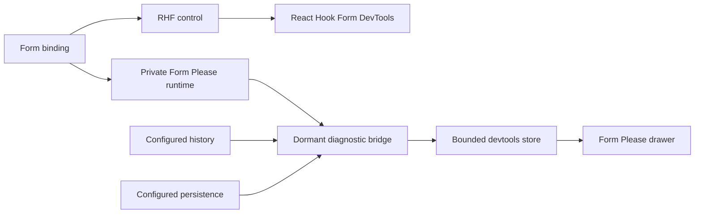

# Form Please Devtools

**Status:** Implemented architecture and interaction model.

## Product outcome

React Hook Form DevTools answers "what state does RHF own?" Form Please
Devtools answers "why did Form Please render and change the form this way?"

| Lens | Owns |
| --- | --- |
| React Hook Form DevTools | Registered fields, values, errors, dirty, touched, and form state |
| Form Please Devtools | Resolved UI, issue routing, managed updates, async options, history, and persistence |

The public integration is one component:

```tsx
import { FormPleaseDevtools } from "form-please/devtools"

function CheckoutForm() {
	const form = checkoutKit.useForm(checkoutDefinition, {
		defaultValues: checkoutDefaults,
	})

	return (
		<>
			<checkoutKit.AutoForm form={form} />
			<FormPleaseDevtools form={form} name="Checkout" />
		</>
	)
}
```

`form` is the complete identity and connection. No separate ID, middleware,
provider, or store is required. `name` is an optional readable label. The
component generates `Form 1`, `Form 2`, and so on when the label is absent.

The component mounts the public `@hookform/devtools` overlay with
`form.api.control`. It also mounts a Form Please launcher and bottom drawer.
The RHF overlay stays at the top-right. Form Please does not deep-import, fork,
or reproduce RHF DevTools private UI.

Applications should render the component only in development. Importing the
root, presets, history, or persistence does not load the devtools UI or event
journal.

## Runtime shape



The root runtime contains a package-private observer bridge. It allocates no
event journal and performs no diagnostic work until the optional component
attaches to the exact form capability. The devtools store then observes:

- resolved definition publications and focus outcomes;
- proposal, `beforeUpdate`, middleware, commit, `afterUpdate`, and async
  settlement stages for managed updates;
- RHF value publications outside a managed commit;
- async option requests and their observed value or context dependencies;
- configured history and persistence snapshots.

The store retains at most 100 updates and 20 transitions for each optional
feature. Disconnecting the component releases all subscriptions. RHF remains
the only live form store and value authority.

## Presentation

The Form Please launcher opens a resizable bottom drawer. Its initial height is
44 percent of the viewport. The drawer has four stable views:

| View | Content |
| --- | --- |
| **UI** | Complete resolved tree, including hidden nodes; effective and inherited state; issue routing; submit focus; copy path; highlight control |
| **Updates** | Managed and direct RHF publications; source, paths, pipeline stages, patches, values, outcome, and duration |
| **Options** | Static and async option sources; current and previous request; observed dependencies, duration, error, and option count |
| **Features** | Configured or absent history and persistence; current snapshot, internal status details, and recent transitions |

`UI` is the default view. Search is local to the UI and update lists. Recording
can be paused without pausing or changing the form. All diagnostic views are
read-only.

Every generated field path uses RHF dot notation. **Copy RHF path** is the
handoff to the RHF inspector. **Highlight** scrolls to the generated DOM target
when it exists. Hidden nodes remain inspectable but have no highlight target.

## Data and limits

The first release shows local runtime values, context, patches, errors, and
feature details as raw development data. The value viewer handles functions,
browser values, maps, sets, errors, and cycles without JSON serialization.
It limits depth and collection size before rendering.

There is no export, remote forwarding, sanitizer API, state editing, forced
submit, history seek, persistence action, validation trace, or generic React
profiler. Add those capabilities only after their safety and lifecycle are
designed explicitly.
